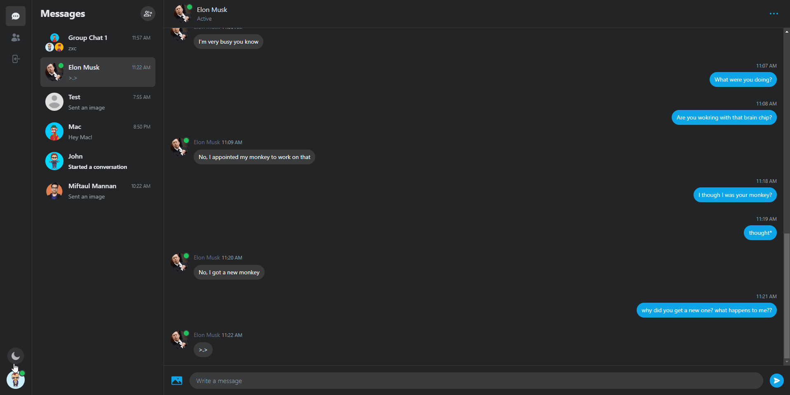
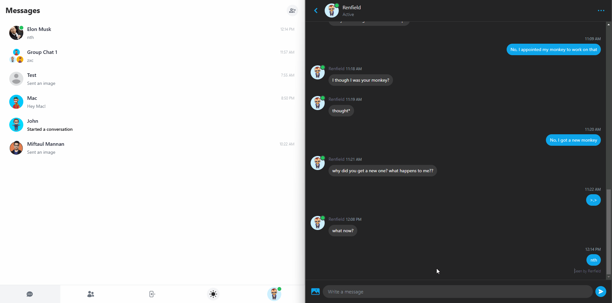

# NextJs-Messenger-Clone

A fully responsive real-time chat app made with NextJs 13 (app router), MongoDB, Tailwind CSS, Pusher, Next-Auth and Cloudinary.

 
    </img>

- **[NextJs](https://nextjs.org/)** (13.4.x)
- **[React](https://facebook.github.io/react/)** (18.x)
- **[MongoDB](https://www.mongodb.com/atlas/database)** (6.x)
- **[Tailwind CSS](https://tailwindcss.com/)** (3.x)
- **[Pusher](https://pusher.com/)** (5.x)
- **[Next-Auth](https://next-auth.js.org/)** (4.x)
- **[Typescript](https://www.typescriptlang.org/)** (5.x)
- Production build script

## Live Demo

See a [live demo](https://nextjs-messenger-clone-tasin5541.vercel.app/) on Vercel

## Features

 
    </img>

- Real-time chat update with Pusher
- Group chat
- Delete chat history
- Image hosting with Cloudinary
- Dynamic Theme support (Light and Dark mode)
- Support for both Desktop and Mobile screens
 
